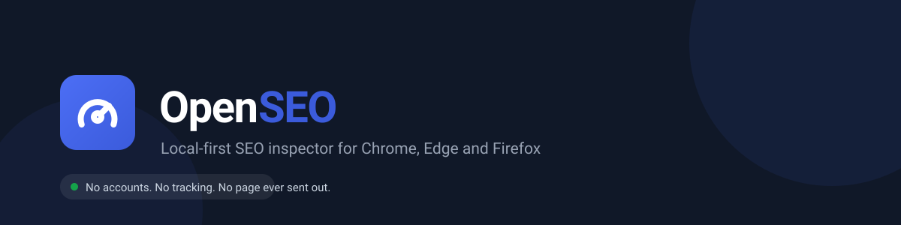
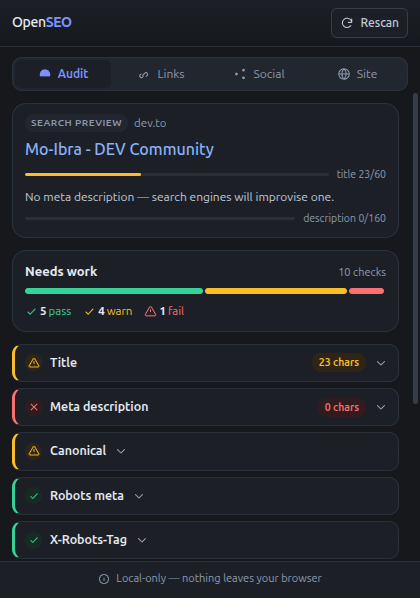
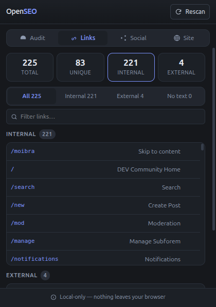
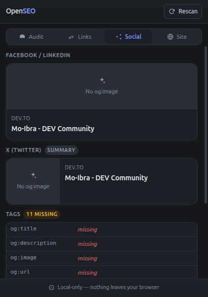
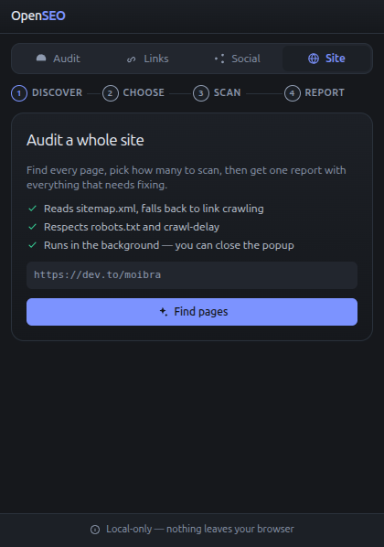
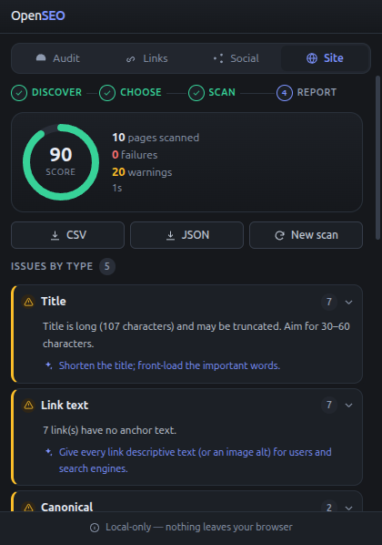
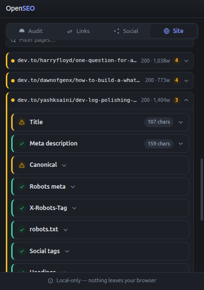

<p align="center">
  
</p>

<p align="center">
  <a href="#screenshots">Screenshots</a> ·
  <a href="#what-it-checks">What it checks</a> ·
  <a href="#how-it-works">How it works</a> ·
  <a href="#contributing">Contributing</a> ·
  <a href="#privacy">Privacy</a>
</p>

---

# Open SEO

A local-first SEO inspector for **Chrome, Edge and Firefox**. Point it at a page
and it tells you what is wrong with that page's SEO — or crawl a whole site and
tell you the same for every page.

Everything runs inside your browser. **No page URL is ever sent to a server, and
the extension collects nothing.**

<p align="center">
  
</p>

## Why it exists

Most SEO tools want you to paste a URL into a website, which means the URL —
and therefore your customer list, your drafts, your internal wiki — travels to
someone else's server. This one reads the page you are already looking at, or
crawls a site you explicitly approve, and keeps the result in your browser.

It is also readable. Every issue comes with a plain-English explanation of what
was found and a concrete suggestion for what to do about it, rather than a score
with no reasoning behind it.

## Screenshots

> Real captures from the extension in dark mode. See
> [`docs/screenshots/README.md`](docs/screenshots/README.md) for what is still
> missing.

### Audit tab



A search-result preview of the page, length meters for the title and meta
description, and one card per check. The verdict bar is proportional: how much of
the page passes, warns or fails.

### Links tab



Every link on the page, split into internal, external and missing-anchor-text.
Filter by text or URL, copy any href with one click.

### Social tab



How the page would render as a Facebook/LinkedIn card and as an X (Twitter)
card, above the raw Open Graph and Twitter Card tags that produced them.

### Site tab







Open the **Site** tab and start an audit. The extension asks for access to that
one origin, finds the pages, and lets you choose which to scan — by preset, by
searching, or page by page. The scan then runs in the background, so the popup
can be closed. When it finishes you get a score, issues grouped by type, a
per-page breakdown, and CSV/JSON export.

## What it checks

Ten checks, one file each. Adding one is a small, self-contained change (see
[Adding a check](#adding-a-check)).

| Check | What it looks at |
|---|---|
| **Title** | Missing, shorter than 30 chars, longer than 60 |
| **Meta description** | Missing, shorter than 70, longer than 160 |
| **Canonical** | Missing, or pointing somewhere other than the page itself |
| **`robots` meta** | `noindex`, `nofollow`, or absent |
| **`X-Robots-Tag`** | `noindex` / `nofollow` sent as a response header |
| **`robots.txt`** | Whether this URL is disallowed for our user agent |
| **Social tags** | Required Open Graph and Twitter Card tags |
| **Headings** | Missing H1, multiple H1s, skipped levels |
| **Links** | Counts, and any link with no accessible text |
| **Word count** | Thin content, and how much text is hidden behind a click |

The character budgets live in exactly one place, [`lib/limits.ts`](lib/limits.ts),
so the checks, the search preview and the counters on the finding cards can never
disagree about the same string.

### A note on hidden content

Word count deliberately **ignores whether text is currently visible**. A closed
accordion, an inactive tab panel, a wizard's hidden step — all of it counts,
because search engines index it and because a number that changes depending on
which tab is open is not a measurement.

The extension does not just quietly add that text in, though. It reports it:

> **Hidden content** — 392 of 452 words (87%) is hidden until the reader clicks,
> expands or steps through it.

That is usually worth knowing. A page where 90% of its text needs a click is
harder to read, harder to link to, and hard to rank on more than one topic.

## How it works

### The single-page audit

The popup reads the page you are on using two functions injected into that page's
own JavaScript context:

- [`lib/extract.ts`](lib/extract.ts) reads everything that lives in the DOM.
- [`lib/site-context.ts`](lib/site-context.ts) makes same-origin requests to read
  what does not: `robots.txt` and the `X-Robots-Tag` response header.

Both must be **completely self-contained** — they are stringified and run inside
the inspected page, so they cannot reference anything from the module scope.
[`tests/unit/extract-selfcontained.test.ts`](tests/unit/extract-selfcontained.test.ts)
recompiles the function in a bare `node:vm` context and fails if that ever breaks,
because the alternative is a `ReferenceError` in production only.

[`lib/audit.ts`](lib/audit.ts) then runs every check over that data and the popup
renders the results.

### The site crawler

The **Site** tab is a separate path, and it reuses the same extractor on a
different DOM implementation — `linkedom` parses the fetched HTML and the
extractor is handed that instead of a live `document`. One function, two callers,
one set of results.

```
discover  ->  robots.txt + sitemap.xml (following sitemap indexes)
              falls back to crawling internal links
           ->  you pick which URLs to scan
scan      ->  4 parallel requests, honouring robots rules and Crawl-delay
           ->  runs in the service worker, so closing the popup is fine
report    ->  score, issues grouped by check type, per-page table, CSV/JSON
```

Because the work happens in the background service worker, an MV3 worker restart
resumes from the persisted queue rather than starting over.

**Politeness is the default, not a setting.** `robots.txt` rules and
`Crawl-delay` are respected, requests are capped at 4 in parallel, each request
has a 10s timeout, and a single scan is capped at 1000 pages.

### Layout

```
entrypoints/
  background.ts        wires the platform to the crawler, nothing else
  popup/               the React UI — see "Inside the popup" below
lib/
  limits.ts            character budgets, and the one grading function
  extract.ts           the injected DOM extractor
  site-context.ts      the injected same-origin request helper
  types.ts             PageData, Finding, Status — the shared vocabulary
  audit.ts             runs every check
  checks/              one file per check
  crawl/               the site crawler
    discover.ts        sitemap, then link crawl
    sitemap.ts         sitemap + sitemap-index parsing
    robots.ts          robots.txt rules and Crawl-delay
    normalize.ts       URL canonicalisation, tracking-param stripping
    http.ts            fetch with timeout and content-type checks
    scan.ts            concurrent fetching
    job.ts             the scan state machine
    report.ts          aggregation, scoring, CSV/JSON export
    store.ts           persistence per origin
  platform/            the only modules that touch extension APIs
    storage.ts         chrome.storage with an in-memory fallback
    messaging.ts       the runtime message protocol
```

### Inside the popup

The popup is split so that nothing is defined twice:

| Folder | Holds |
|---|---|
| `tabs/<name>/` | One folder per tab, with the components only that tab uses. A helper used by one tab stays here; one used by two moves to `shared/`. |
| `shared/` | Components with no tab-specific knowledge: `FilterTabs`, `SearchInput`, `SectionTitle`, `Stepper`, `EmptyState`, `Icon`, `ProgressRing`. |
| `constants/` | `tone.ts` — every pass/warn/fail class pair. `site.ts` — the site-tab tunables. Import from `'../constants'`. |
| `utils/` | Pure display helpers: `url.ts`, `text.ts`, `format.ts`, `download.ts`, `paginate.ts`. No extension APIs. |
| `hooks/` | Reusable React state, currently just `useCopyToClipboard`. |

Styles are Tailwind CSS v4 utilities. The design tokens — including a full dark
theme — live in [`entrypoints/popup/popup.css`](entrypoints/popup/popup.css) under
`@theme`, alongside the few custom utilities (`btn`, `hide-marker`, `skeleton`,
`no-scrollbar`, `spin-slow`).

## Development

```bash
npm install
npm run dev            # Chrome, with hot reload
npm run dev:firefox    # Firefox
```

Load the unpacked build from `.output/chrome-mv3` via `chrome://extensions`
(enable Developer mode → **Load unpacked**). Wxt restarts and reloads the popup
on save.

### All commands

| Command | Does |
|---|---|
| `npm run dev` | Dev server, Chrome |
| `npm run dev:firefox` | Dev server, Firefox |
| `npm run build` | Production build → `.output/chrome-mv3` |
| `npm run build:firefox` | Production build → `.output/firefox-mv2` |
| `npm run zip` | Store-ready archives |
| `npm run compile` | `tsc --noEmit` |
| `npm test` | Vitest, single run |
| `npm run test:watch` | Vitest, watch mode |

### Tests

```bash
npm test
```

**113 tests, and none of them need a browser.** The crawler runs against a
throwaway HTTP server on localhost; the service worker is driven through a fake
`chrome` API.

They are not only there for coverage. Several exist to stop specific mistakes
coming back:

- **The extractor self-containment guard** recompiles the injected function in a
  bare VM context, so nobody can add a module-scope reference.
- **Word-count visibility tests** pin down that the count never depends on render
  state. A closed `<details>`, a `.collapse` accordion, a stepper whose inactive
  panels are `display: none`, and a page with `checkVisibility()` monkeypatched
  to return `false` for every element all have to produce the same total. This
  guard exists because that bug shipped twice.
- **The pagination tests** check that a stale page number can never render an
  empty list, and that every item appears exactly once across all pages.
- **The Tailwind class check** compares every class name used in the popup against
  the *built* stylesheet. Tailwind only emits classes it can see as literals, so
  a typo in a class name would otherwise render unstyled and fail silently.
- **The JSX escape check** fails on `\uXXXX` inside JSX text, where an escape is
  not interpreted and would render as six literal characters.

## Contributing

Contributions are welcome, including small ones.

### Getting set up

```bash
git clone https://github.com/your-account/open-seo.git
cd open-seo
npm install
npm test        # should pass before you change anything
```

### Making a change

1. Branch off `main`.
2. Make the change, with a test that would have caught the bug if you were fixing
   one. The suite runs in about a second — there is no excuse for not running it.
3. `npm run compile && npm test` must both be clean.
4. Open a PR describing what changed and why.

### Adding a check

This is the most common contribution and it is deliberately easy. Create
`lib/checks/my-check.ts`:

```ts
import { TITLE_BUDGET } from '../limits'
import type { Check } from '../types'

export const myCheck: Check = (page, context) => [
  {
    id: 'my-check',                 // stable, kebab-case
    label: 'My check',              // shown as the card heading
    value: page.title ?? null,      // the value that was audited
    length: page.title?.length,     // optional; renders a "N chars" chip
    budget: TITLE_BUDGET,           // optional; grades the chip
    status: 'warn',                 // 'pass' | 'warn' | 'fail'
    message: 'What was found, in a sentence.',
    fix: 'What to do about it.',    // optional
    items: [],                      // optional; renders a scrollable list
  },
]
```

Then register it in the `checks` array in [`lib/audit.ts`](lib/audit.ts). That is
the whole change — the popup renders it, and the site report groups it with every
other page that failed the same check.

Return `[]` for "nothing to report" so the check simply produces no finding.

### House rules

These exist to stop the codebase drifting, and they are all enforced by a test or
a type:

- **The `lib/platform/` boundary is real.** Nothing outside it may touch
  `chrome.*` or `wxt/browser`. Everything else stays platform-free and runnable in
  plain Node, which is what makes the tests fast.
- **Injected functions stay self-contained.** No module-scope references in
  `lib/extract.ts` or `lib/site-context.ts`.
- **Define a class name once.** Every pass/warn/fail colour lives in
  `constants/tone.ts`, and every tunable lives in `constants/`. If you find
  yourself writing the same class string twice, it belongs in a map.
- **Tailwind classes are literal strings.** Never `bg-${status}` — Tailwind
  cannot see it, so it will not be generated.
- **No `\uXXXX` escapes in `.tsx` files.** In JSX text an escape is not
  interpreted. Write the character.
- **Comments explain *why*, not *what*.** The code already says what it does.

### Good first issues

- [ ] `alt` text coverage check (images are the most-missed on-page issue)
- [ ] Render JavaScript in site scans so SPAs are not reported as empty
- [ ] AI-search readiness checks (`llms.txt`, AI-crawler directives)
- [ ] Screenshot and polish pass on the report view

## Privacy

There is no server. There is no account. There is no analytics.

- Page content is read in the browser and never transmitted.
- Site scans request host access for **the one origin you are scanning**, and
  only at the moment you start a scan. Never `<all_urls>` up front.
- Scan state is stored in `chrome.storage` on your machine, so a scan survives a
  popup or service-worker restart. It never leaves the browser.
- No telemetry, no crash reporting, no error reporting.

### Permissions, and why each is needed

| Permission | Why |
|---|---|
| `activeTab` | Read the current tab, only when you open the popup |
| `scripting` | Inject the extractor into that page's context |
| `storage` | Persist scan state so a background scan survives a restart |
| optional hosts | Requested per origin, only when you start a site scan |

If `storage` is unavailable the extension says so in the Site tab rather than
silently losing your scan.

## Known limitations

- **Client-side rendered pages look empty in site scans.** The crawler fetches
  HTML and does not run JavaScript, so an SPA's content is not there to audit.
  The single-page audit has no such problem — it reads the rendered DOM. Rendering
  JS in the crawler is on the roadmap.
- **Hidden content cannot be detected by the crawler.** It sees the served HTML,
  so content that a page injects at runtime is invisible to it. The *popup* sees
  the live DOM and does report it.
- **Word count is character-based, not pixel-width-based.** A pixel measurement
  would be more accurate; the current limits are a reasonable approximation and
  can be replaced in `lib/limits.ts` without touching callers.
- **Scans are capped at 1000 pages** per run.

## Roadmap

- [x] Single-page audit with title, description, canonical, indexability, social, headings, links, word count
- [x] Links and Social tabs
- [x] Search-result preview
- [x] Site crawler with sitemap discovery, background scanning, and a report
- [x] CSV/JSON export
- [ ] `alt` text check
- [ ] JavaScript rendering for SPA pages in site scans
- [ ] AI-search readiness checks
- [ ] Lighthouse-style Core Web Vitals readout

## License

MIT — see [LICENSE](LICENSE).
